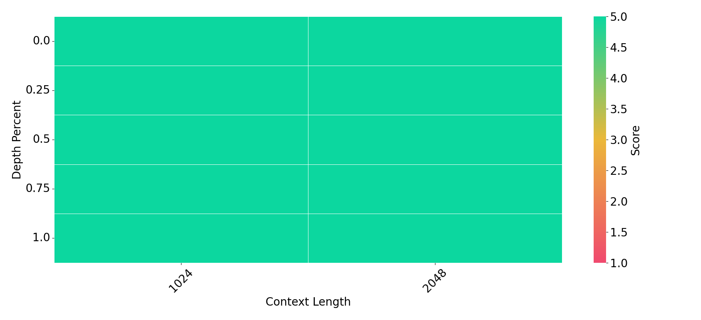
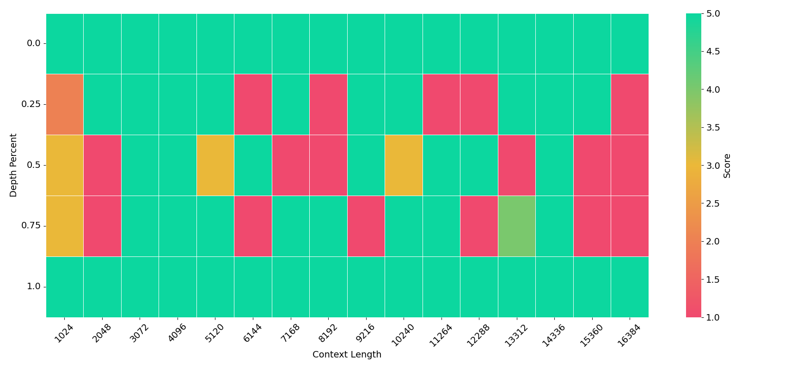
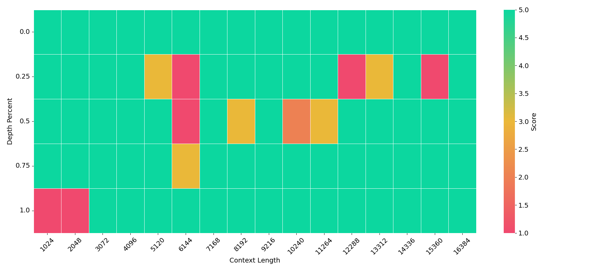

# Hari

Hari is the Japanese version of [Needle In A Haystack](https://github.com/gkamradt/LLMTest_NeedleInAHaystack), a benchmark for evaluating long-context capabilities of large language models (LLMs).

# Overview

**Needle In A Haystack** is a benchmark designed to assess how well LLMs can retrieve a "needle"—a short, relevant passage—from a "haystack," a much longer text that contains it.

This task evaluates a model’s ability to process, retain, and retrieve information across long contexts. For example, given a long document (e.g., a collection of Wikipedia articles) containing the sentence "The capital of Japan is Tokyo," and a question such as "What is the capital of Japan?", the model must retrieve the sentence that answers the question.

To test performance under diverse conditions, the needle is inserted at various positions within the haystack, and the haystack’s length is systematically varied.

Hari differs from the original benchmark in the following ways:
- Both the haystack and the needle are in Japanese.
- Modified instructional prompts to make it easier to understand the questions for the model.
- The set of sentence boundary tokens is expanded to {'。', '\n', '.', '!', '?'} instead of just '.'.


# Usage

Install the dependencies:
```bash
$ uv sync
```

Run the evaluation:
```bash
$ python src/hari/evaluate.py --model gpt-4o-2024-11-20 --needle "京都でおすすめの観光地は、ロームシアター京都の３階にあるラウンジです。" --question "京都でおすすめの観光地はどこですか？"
```


Plot the result:
```bash
$ python src/hari/plot.py
```

gpt-4o-2024-11-20




gemma-3-4b-it


Qwen2.5-7B-Instruct


# TODO
- [ ] Length should be calculated using tokenizers, not codepoint.
- [ ] Add more models.
- [ ] Add more Judgers.
- [ ] More Flexible dataset.


# References
- https://github.com/gkamradt/LLMTest_NeedleInAHaystack

