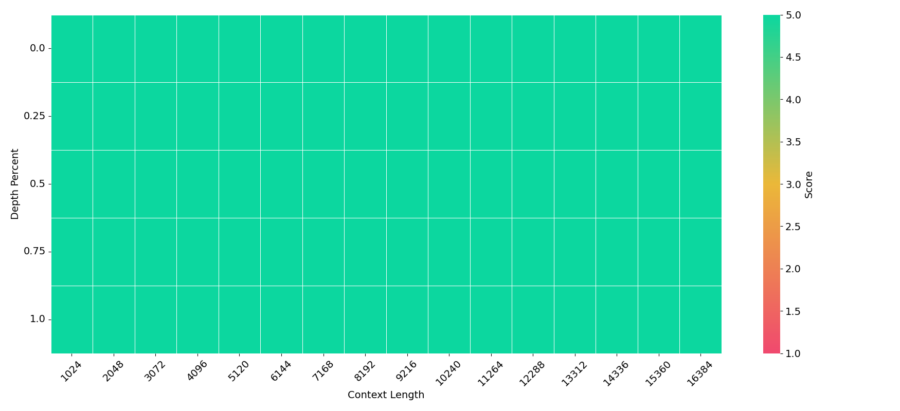

# Hari
Japanese version of Needle In A Haystack (https://github.com/gkamradt/LLMTest_NeedleInAHaystack)

# Usage

Install the dependencies:
```bash
$ uv sync
```

Run the evaluation:
```bash
$ python src/hari/evaluate.py --model gpt-4o-2024-11-20
```

Plot the result:
```bash
$ python src/hari/plot.py
```




# TODO
- [ ] Length should be calculated using tokenizers, not codepoint.
- [ ] Add more models.
- [ ] Add more Judgers.
- [ ] More Flexible dataset.


# References
- https://github.com/gkamradt/LLMTest_NeedleInAHaystack

